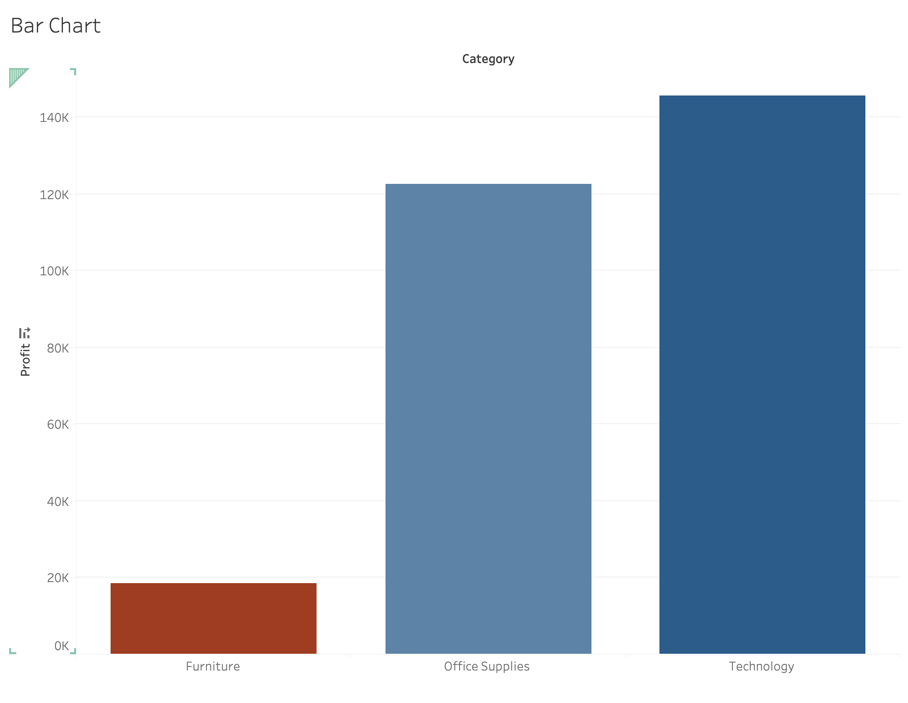
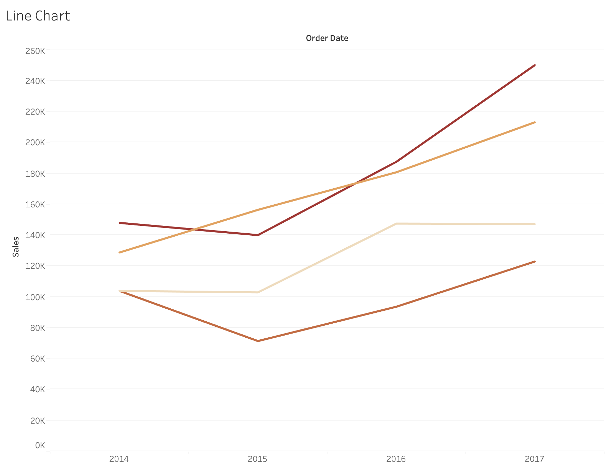
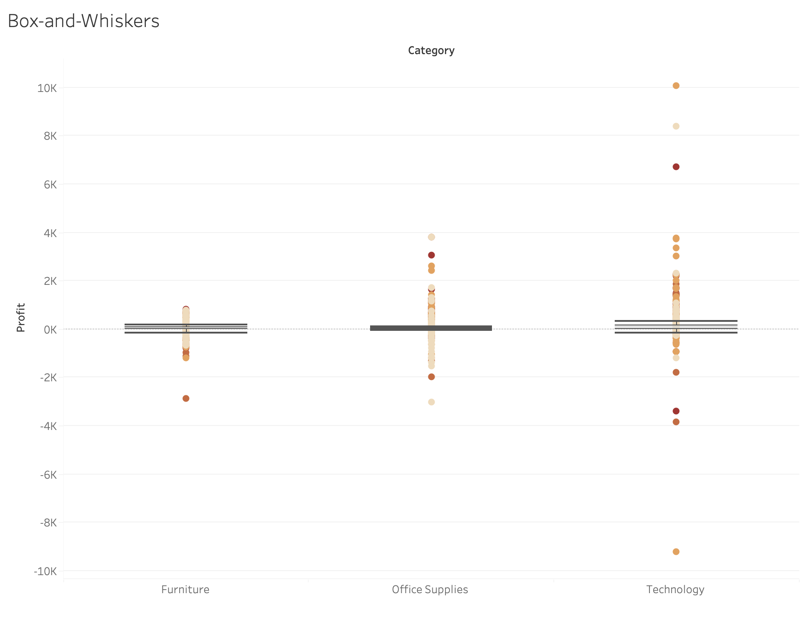

## Tableau Visualizations for Superstore Dataset

This repository contains Tableau-based visual data analysis of the *Superstore* dataset, focusing on business insights through a series of well-structured visualizations.

### Tools Used:

* Tableau Public
* Superstore Dataset (`.csv` format)

### 1 Bar Chart: **Profit by Category**

**Objective:**
To compare total profit across major product categories.

**Steps to Create:**

* Drag `Category` to **Columns**.
* Drag `Profit` to **Rows**.
* Use **Bar Chart** from the *Show Me* panel.
* Optionally, apply **color** to reflect profit range visually.

**Insight:**
Technology leads in profitability, while Furniture shows the lowest overall profit.

### 2 Line Chart: **Sales Trend Over Time**

**Objective:**
To analyze how sales trends evolved across different years.

**Steps to Create:**

* Drag `Order Date` to **Columns** (set to **year**).
* Drag `Sales` to **Rows**.
* Add `Category` to **Color** (to show separate lines).
* Use **Line Chart** from *Show Me*.

**Insight:**
Technology and Office Supplies experienced strong sales growth over the years, especially after 2015.

### 3 Box-and-Whiskers: **Profit Distribution by Category**

**Objective:**
To explore the distribution, spread, and outliers of profits across categories.

**Steps to Create:**

* Drag `Category` to **Columns**.
* Drag `Profit` to **Rows**.
* Drag `Product Name` to **Detail**.
* Select **Box-and-Whiskers** from *Show Me*.

**Insight:**
All categories show a wide spread of profits, with Technology having more positive outliers and higher variance.

### 4 Scatter Plot: **Sales vs. Profit**

**Objective:**
To identify correlation between sales and profit across products.

**Steps to Create:**

* Drag `Profit` to **Columns**.
* Drag `Sales` to **Rows**.
* Drag `Category` or `Sub-Category` to **Color** or **Detail**.
* Use **Scatter Plot** from *Show Me*.

**Insight:**
Many products have high sales but low or negative profit — a potential red flag for pricing or discounting strategy.

## Key Takeaways

* Visuals are designed with **clarity, minimal clutter, and direct insights**.
* **Contextual annotations** help highlight trends or anomalies.
* The analysis aims to drive **business decisions**, not just display data.
